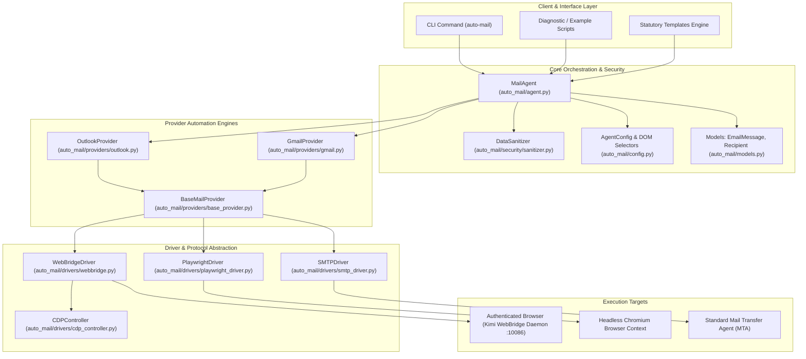
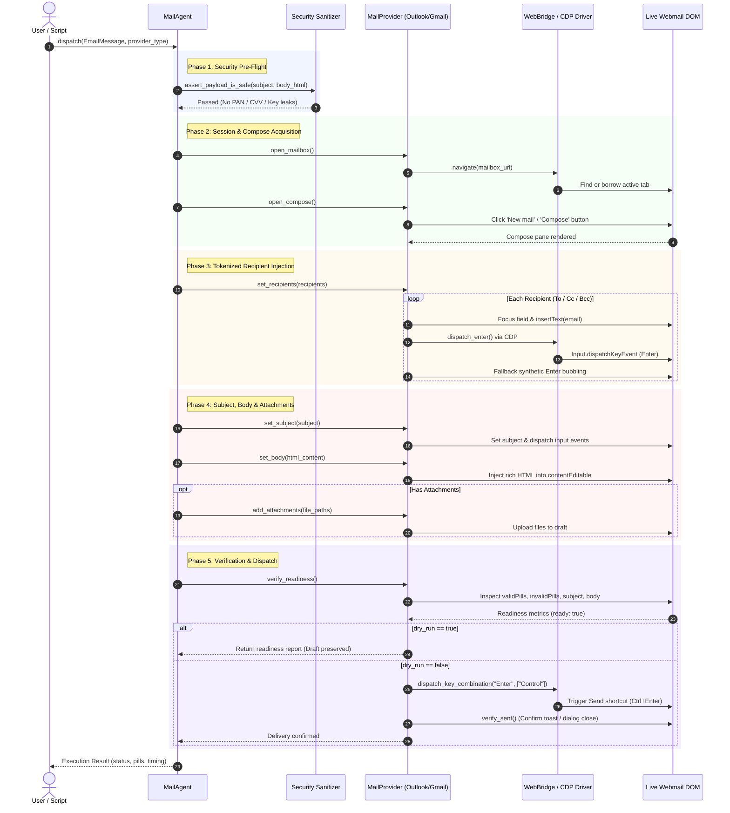

# AUTO-MATIC-MAIL-AGENT 🚀

> **Autonomous Browser-Driven & Protocol-Level Email Dispatch Engine**  
> Built for Microsoft Outlook Web, Google Gmail Web, and Direct SMTP with Chrome DevTools Protocol (CDP) tokenization, zero-credential privacy guards, and statutory grievance automation.

---

## 📌 Table of Contents
1. [System Architecture Diagram](#-system-architecture-diagram)
2. [Core Engineering Highlights](#-core-engineering-highlights)
3. [End-to-End Sequence Flow](#-end-to-end-sequence-flow)
4. [Graphify Knowledge Graph & Codebase Navigation](#-graphify-knowledge-graph--codebase-navigation)
5. [Complete Codebase File Index](#-complete-codebase-file-index)
6. [Quickstart & Usage Guides](#-quickstart--usage-guides)
7. [Verification & Test Suite](#-verification--test-suite)

---

## 🏛️ System Architecture Diagram



---

## ⚡ Core Engineering Highlights

### 1. CDP-Powered Native Recipient Tokenization
* **Problem**: Automating webmail To/Cc fields via standard DOM `.value` assignments leaves emails as raw uncommitted text strings or causes Microsoft Outlook to render red-bordered `invalidPill` badges that block sending.
* **Solution**: Auto-Matic-Mail-Agent combines content-editable DOM text injection (`document.execCommand('insertText')`) with native virtual keycode sequences (`Input.dispatchKeyEvent` with `windowsVirtualKeyCode: 13`) via the Chrome DevTools Protocol (CDP).
* **Validation**: Pre-flight inspection scans the live DOM for `[class*="personaPill"]`, `[class*="validPill"]`, and verifies `[class*="invalidPill"]` count is strictly zero before proceeding.

### 2. Zero-Leakage Privacy & PCI-DSS Data Sanitizer
* **Strict Pre-Dispatch Assertion**: Before any network traffic or browser keystrokes occur, `assert_payload_is_safe` scans subject lines, plain text, and HTML bodies.
* **Luhn Algorithm Verification**: Performs real-time Luhn checksum validation on 13-to-19 digit number sequences to catch Visa, MasterCard, Amex, RuPay, and Discover PAN leaks while preventing false alarms on tracking numbers.
* **Secret Scrubbing**: Automatically detects and redacts 3-4 digit CVV/CVC codes, card expiration dates, and OpenSSH / RSA cryptographic private key blocks.

### 3. Active Browser Session Borrowing via Kimi WebBridge
* **Daemon Protocol**: Connects via HTTP `/command` socket to `http://127.0.0.1:10086` using the local WebBridge daemon.
* **Active Tab Borrowing**: Instead of forcing a redundant login or new browser window, `navigate()` intelligently checks for open Outlook or Gmail tabs in the user's active session and attaches seamlessly in place.
* **Fallback Drivers**: Native support for isolated Playwright headless browser runs (for CI/CD environments) and direct `smtplib` multipart dispatch.

### 4. Dual-Jurisdiction Statutory Grievance Generator
* **Regulatory Compliance**: Built-in template engine generates formal legal notices under the **Consumer Protection Act, 2019 (India)** and the **Consumer Protection (Fair Trading) Act (Singapore)**.
* **Multi-Authority Routing**: Automatically compiles recipient rosters addressing executive support, legal counsel, developer relations, and financial regulators (RBI, CCPA, CASE, MAS).

---

## 🔄 End-to-End Sequence Flow



---

## 🧠 Graphify Knowledge Graph & Codebase Navigation

The codebase architecture is mapped and tracked via a persistent **Graphify Knowledge Graph** at `graphify-out/`.

### Graph Metrics
* **Total Nodes**: `408`
* **Total Edges**: `576`
* **Community Clusters**: `42`
* **Extraction Confidence**: `89% EXTRACTED` · `11% INFERRED` · `0% AMBIGUOUS`

### Top "God Nodes" (Core Architectural Hubs)
| Node Identifier | Degree | Role in System |
|---|:---:|---|
| **`OutlookProvider`** | 20 edges | Microsoft 365 / Outlook Web automation & pill badge validator |
| **`GmailProvider`** | 20 edges | Google Gmail Web automation & recipient chip tokenization |
| **`WebBridgeDriver`** | 19 edges | Kimi WebBridge daemon HTTP client with CDP socket control |
| **`PlaywrightDriver`** | 17 edges | Standalone headless / persistent Chromium execution driver |
| **`MockDriver`** | 17 edges | High-fidelity test double for deterministic driver verification |
| **`MailAgent`** | 15 edges | Master orchestrator coordinating providers, drivers, and security |
| **`SMTPDriver`** | 15 edges | Standard RFC 5321/5322 protocol delivery fallback |
| **`Recipient`** | 13 edges | Pydantic data model with regex syntax enforcement |
| **`EmailMessage`** | 13 edges | Builder pattern payload object with role-based recipient grouping |
| **`MailAgentError`** | 13 edges | Root exception hierarchy for domain errors |

---

## 📂 Complete Codebase File Index

Every file in the repository serves a distinct architectural purpose:

| File Path | Component | Responsibility |
|---|---|---|
| [`send_outlook.py`](send_outlook.py) | **One-Shot CLI** | **Interactive & one-command Outlook mail dispatcher with zero-touch delivery** |
| [`auto_mail/__init__.py`](auto_mail/__init__.py) | Package Root | Exposes public API: `MailAgent`, `EmailMessage`, `Recipient`, `ProviderType` |
| [`auto_mail/agent.py`](auto_mail/agent.py) | Orchestrator | Coordinates security scanning, driver initialization, and provider dispatch |
| [`auto_mail/config.py`](auto_mail/config.py) | Configuration | Pydantic settings for WebBridge, timeouts, and Outlook/Gmail DOM selectors |
| [`auto_mail/exceptions.py`](auto_mail/exceptions.py) | Error Handling | Hierarchy: `ComposeTimeoutError`, `RecipientValidationError`, `DataSanitizationError` |
| [`auto_mail/models.py`](auto_mail/models.py) | Data Layer | Strict data models: `EmailMessage`, `Recipient`, `Attachment`, `RecipientRole` |
| [`auto_mail/drivers/__init__.py`](auto_mail/drivers/__init__.py) | Driver Root | Exports `BaseMailDriver`, `WebBridgeDriver`, `PlaywrightDriver`, `SMTPDriver` |
| [`auto_mail/drivers/base.py`](auto_mail/drivers/base.py) | Interface | Abstract base class `BaseMailDriver` defining standard browser/protocol methods |
| [`auto_mail/drivers/cdp_controller.py`](auto_mail/drivers/cdp_controller.py) | CDP Protocol | Low-level Chrome DevTools Protocol payloads (`Input.dispatchKeyEvent`, `DOM.setFileInputFiles`) |
| [`auto_mail/drivers/webbridge.py`](auto_mail/drivers/webbridge.py) | WebBridge Client | Client for Kimi WebBridge daemon (`:10086`), native `fill()`, active tab borrowing, screenshotting |
| [`auto_mail/drivers/playwright_driver.py`](auto_mail/drivers/playwright_driver.py) | Playwright Client | Standalone browser driver for automated CI/CD runs |
| [`auto_mail/drivers/smtp_driver.py`](auto_mail/drivers/smtp_driver.py) | Protocol Client | Native Python `smtplib` driver with STARTTLS and MIME attachment support |
| [`auto_mail/providers/__init__.py`](auto_mail/providers/__init__.py) | Provider Root | Exports `BaseMailProvider`, `OutlookProvider`, `GmailProvider` |
| [`auto_mail/providers/base_provider.py`](auto_mail/providers/base_provider.py) | Base Engine | Abstract contract for webmail providers (open mailbox, compose, set fields, verify) |
| [`auto_mail/providers/outlook.py`](auto_mail/providers/outlook.py) | Outlook Engine | Fluent UI pill validation, native fill + contentEditable, readiness inspection |
| [`auto_mail/providers/gmail.py`](auto_mail/providers/gmail.py) | Gmail Engine | Gmail chip tokenization, TrustedHTML bypass, delivery toast verification |
| [`auto_mail/security/__init__.py`](auto_mail/security/__init__.py) | Security Root | Exports `DataSanitizer`, `assert_payload_is_safe`, `is_luhn_valid` |
| [`auto_mail/security/sanitizer.py`](auto_mail/security/sanitizer.py) | PCI-DSS Guard | Luhn PAN detector, CVV scrubber, private key leak blocker |
| [`auto_mail/templates/__init__.py`](auto_mail/templates/__init__.py) | Templates Root | Exports statutory legal and developer claim templates |
| [`auto_mail/templates/legal_grievance.py`](auto_mail/templates/legal_grievance.py) | Grievance Template | Formats dual-jurisdiction statutory legal notices (India & Singapore) |
| [`auto_mail/templates/student_pack_claim.py`](auto_mail/templates/student_pack_claim.py) | Claim Template | Formats GitHub Student Developer Pack cloud verification claims |
| [`examples/send_outlook_only.py`](examples/send_outlook_only.py) | Focused Runner | Dedicated Outlook → Gmail dispatch script with preview screenshot |
| [`examples/send_gmail_only.py`](examples/send_gmail_only.py) | Focused Runner | Dedicated Gmail → Outlook dispatch script with chip + subject verification |
| [`examples/run_cross_verification.py`](examples/run_cross_verification.py) | Cross-Verification | Automated bi-directional test between Outlook and Gmail |
| [`examples/test_cdp_pills.py`](examples/test_cdp_pills.py) | Diagnostic CLI | Diagnostic script testing Outlook pills and Gmail chips without sending |
| [`examples/send_outlook_grievance.py`](examples/send_outlook_grievance.py) | Example | End-to-end statutory grievance dispatch example via Outlook Web |
| [`examples/send_gmail_notice.py`](examples/send_gmail_notice.py) | Example | Developer cloud deployment notice dispatch example via Gmail Web |
| [`examples/multi_provider_sync.py`](examples/multi_provider_sync.py) | Example | Unified multi-provider dispatch pattern demonstration |
| [`tests/__init__.py`](tests/__init__.py) | Test Suite Root | Test package initializer |
| [`tests/test_models.py`](tests/test_models.py) | Unit Tests | Validates recipient email syntax, builder methods, and attachment checks |
| [`tests/test_sanitizer.py`](tests/test_sanitizer.py) | Unit Tests | Validates Luhn card algorithm, CVV detection, and private key leak prevention |
| [`tests/test_cdp_controller.py`](tests/test_cdp_controller.py) | Unit Tests | Validates CDP Enter key and Ctrl+Enter sequence payloads |
| [`tests/test_providers.py`](tests/test_providers.py) | Unit Tests | Validates Outlook and Gmail provider flows with deterministic `MockDriver` |
| [`pyproject.toml`](pyproject.toml) | Packaging | PEP 621 build configuration and `[tool.pytest.ini_options]` settings |
| [`requirements.txt`](requirements.txt) | Dependencies | Core runtime requirements: `requests`, `pydantic`, `playwright`, `pytest` |
| [`.gitignore`](.gitignore) | Version Control | Standard Python, virtualenv, and IDE ignore patterns |

---

## 🚀 Quickstart & Usage Guides

### 1. Prerequisites
Ensure Python 3.9+ is installed and install project dependencies:
```bash
pip install -r requirements.txt
```
If using the browser-based driver, ensure the **Kimi WebBridge** daemon is running on port `10086`:
```bash
# Check daemon health
curl -s http://127.0.0.1:10086/status
```

### 2. ⚡ One-Shot Outlook Mail Dispatcher (`send_outlook.py`)
Dispatch emails via Microsoft Outlook Web in one go, either interactively or through a single command:

#### Interactive Mode (Just load and tell what to mail!):
```bash
python send_outlook.py
```
> Prompts for Recipient `To`, optional `Cc`, `Subject`, `Body` (single-line, multiline, or `@file`), optional `Attachment`, shows a formatted confirmation preview box, and sends in one shot!

#### Single Direct Command:
```bash
# Instant send with automatic confirmation skip (-y)
python send_outlook.py -t sgarmy200@gmail.com -s "Quick Update" -b "Hello from the agent!" -y

# With CC, multi-line/HTML body, and attachment:
python send_outlook.py \
  -t "sgarmy200@gmail.com" \
  -c "team@example.com" \
  -s "Sprint Report" \
  --body-file ./report.html \
  -a ./assets/summary.pdf \
  -y

# Dry-run inspection (populates compose, verifies badges, takes preview screenshot, doesn't send):
python send_outlook.py -t "client@example.com" -s "Review" -b "Draft text" --dry-run
```

### 3. 📬 Focused Gmail Dispatcher (`send_gmail_only.py`)
Send from Gmail Web to any recipient in one command:
```bash
python examples/send_gmail_only.py
```
> Verifies Gmail tab is open, sets recipient chip, subject via native fill, injects body (TrustedHTML-safe), screenshots compose, and dispatches with Ctrl+Enter — confirms "Message sent" toast.

### 4. Running Diagnostic Pill/Chip Validation
Verify recipient badges without sending any email:
```bash
# Run both Outlook and Gmail pill/chip validation
python examples/test_cdp_pills.py --provider all

# Test Outlook with custom recipients
python examples/test_cdp_pills.py --provider outlook --to support@heroku.com --cc consumer-helpline@nic.in

# Test Gmail chip tokenization
python examples/test_cdp_pills.py --provider gmail
```

### 5. Programmatic Python API
```python
from auto_mail import MailAgent, EmailMessage, ProviderType

# 1. Initialize orchestrator
agent = MailAgent(driver_type="webbridge", session_name="my-mail-session")

# 2. Build secure message
msg = EmailMessage(
    subject="Automated Deployment Notice",
    body_html="<p>Application successfully deployed to production.</p>"
)
msg.add_to("team-lead@example.com")
msg.add_cc("devops@example.com")

# 3. Dry-run verification (populates & verifies DOM without sending)
result = agent.dispatch(msg, provider_type=ProviderType.OUTLOOK, dry_run=True)
print("Readiness verified:", result["readiness"])

# 4. Final dispatch
# agent.dispatch(msg, provider_type=ProviderType.OUTLOOK, dry_run=False)
```

### 6. Command-Line Interface (CLI)
```bash
# Dry-run dispatch via CLI
python -m auto_mail.agent \
  --provider outlook \
  --to "support@example.com" \
  --subject "System Status" \
  --body "All systems normal." \
  --dry-run
```

---

## 🧪 Verification & Test Suite

The test suite provides comprehensive offline coverage without needing a live browser:

```bash
# Run the complete test suite
pytest -v
```

```text
============================= test session starts =============================
collected 16 items

tests\test_cdp_controller.py ...                                         [ 18%]
tests\test_models.py ....                                                [ 43%]
tests\test_providers.py ....                                             [ 68%]
tests\test_sanitizer.py .....                                            [100%]

============================= 16 passed in 2.30s ==============================
```

---

## 📄 License
MIT License. Authored and maintained by Roshan Rathore.
